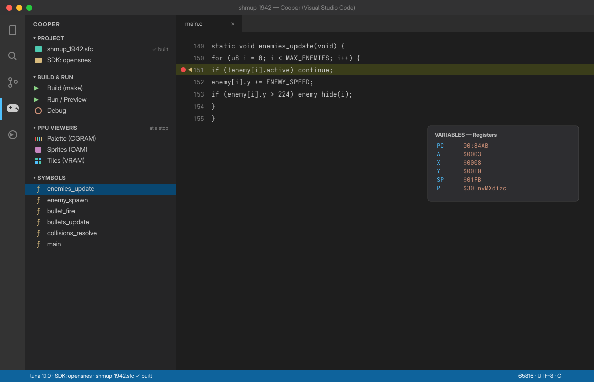
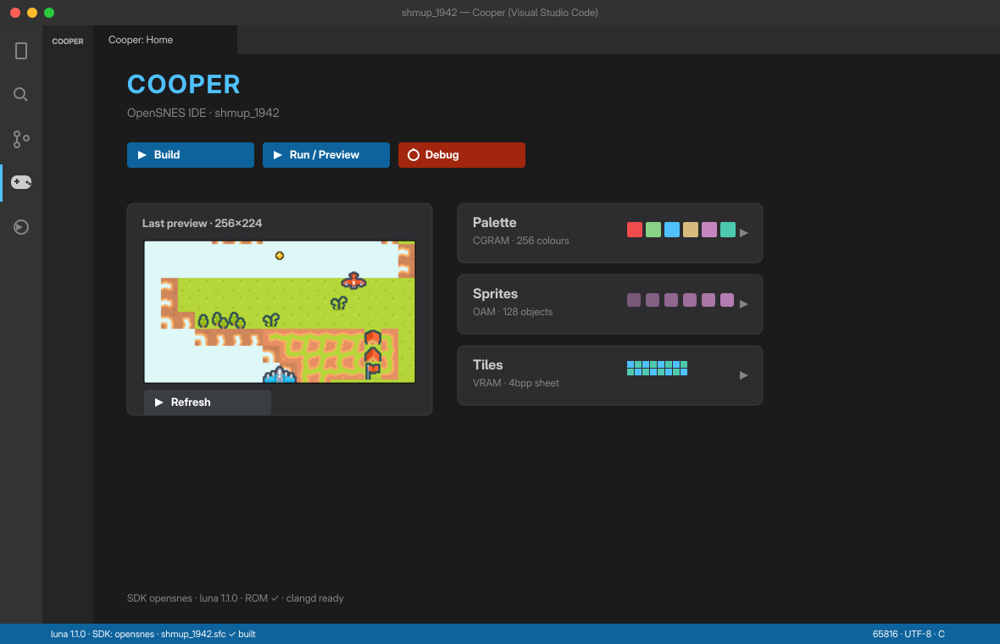
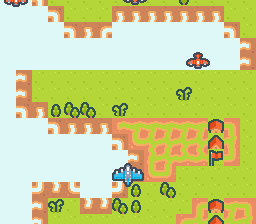
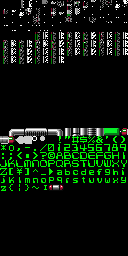

# Cooper — User Guide

Cooper is a VS Code extension that turns VS Code into an **IDE for making SNES
games** with the OpenSNES SDK and the luna emulator: C support, one-click build &
run, and a real **debugger** (breakpoints, registers, memory, live PPU viewers).

> Status: this guide tracks the shipped extension (v0.24.x). Sections marked
> **(coming)** are not implemented yet.

---

## 1. Prerequisites

Cooper orchestrates tools it does **not** bundle — install them once:

| Tool | What it is | How Cooper finds it |
|---|---|---|
| **OpenSNES SDK** | the libraries + `make` rules + `cc65816` compiler | setting `cooper.opensnesPath`, else the project Makefile, else a parent search |
| **luna** | the SNES emulator (run / preview / debug backend) | setting `cooper.lunaPath`, else the SDK's bundled binary, else `luna` on your PATH |
| **clangd** | the C language server (completion, hover, go-to-definition) | the bundled *clangd* VS Code extension downloads it in one click |

### Where to get them — download, don't compile

No compiler to install: **download the prebuilt SDK and emulator for your
architecture and unzip them.** You only need `make` and a text editor.

- **OpenSNES SDK** — grab the release for your platform from
  <https://github.com/k0b3n4irb/opensnes/releases> and extract it somewhere
  permanent (e.g. `~/opensnes`):

  | Platform | Asset |
  |---|---|
  | Linux x86_64 | `opensnes_<version>_linux_x86_64.zip` |
  | Linux aarch64 (arm64) | `opensnes_<version>_linux_arm64.zip` |
  | macOS arm64 | `opensnes_<version>_darwin_arm64.zip` |
  | Windows x86_64 | `opensnes_<version>_windows_x86_64.zip` |

  It ships its own cross-compiler + tools (`cc65816`, `qbe`, `wla-65816`,
  `gfx4snes`…) in `bin/` — nothing else to build. Point `cooper.opensnesPath` at
  that folder. You just need `make` (macOS: `xcode-select --install`; Ubuntu/Debian:
  `sudo apt install make`; Fedora: `sudo dnf install make`; Windows: MSYS2 +
  `pacman -S make`).
- **luna** — download the prebuilt binary for your OS from
  <https://github.com/k0b3n4irb/luna/releases/latest>, unzip, and point
  `cooper.lunaPath` at the `luna` binary **or** the folder it unzips into.
- **clangd** — you do **not** install this yourself: the bundled *clangd*
  extension downloads the language server in one click (see §8). (clangd is
  standalone — no separate `clang` needed for IntelliSense.)

> **Source-level C debugging** (highlight your `main.c` line, typed locals, struct
> expansion — §7) needs an OpenSNES **release** that includes Cooper debug info
> (`cc65816` emitting `@cline`/`@dbglocal`). Older releases still work — the
> debugger just falls back to the symbol/register level.

**Key idea — your project is separate from the SDK.** Your game lives in *its own
folder* (just your `.c`, assets, and a Makefile). OpenSNES and luna are installed
elsewhere as *user releases*. Point Cooper at them once:

```jsonc
// .vscode/settings.json  (or your global VS Code settings)
{
  "cooper.opensnesPath": "/path/to/opensnes",
  "cooper.lunaPath": "/path/to/luna"   // the binary OR the folder containing it
}
```

> `cooper.lunaPath` accepts either the `luna` binary or the folder it unzips into
> (which also contains `luna-gui`). If you leave it empty, Cooper looks for the
> SDK's bundled binary, then `luna` on your PATH.

---

> **In a hurry?** After installing, run **Cooper: Get Started** (or click the 🎓 in
> the Cooper panel header) for an interactive, in-editor walkthrough that does
> everything below, step by step.

## 2. Install Cooper

Download the latest `cooper-x.y.z.vsix` from
<https://github.com/k0b3n4irb/cooper/releases/latest> and install it
(`code --install-extension cooper-x.y.z.vsix`, or in VS Code: Extensions →
`…` menu → *Install from VSIX…*). Marketplace **(coming)**. Cooper bundles the
**clangd** extension; when it prompts
*"clangd is not installed"*, click **Install** (or run `clangd: Download language
server`) — one click, no terminal.

---

### Your first project — `Cooper: New Project…`

No project yet? Don't copy files around: run **Cooper: New Project…** (also
offered on the dashboard when no project is open). Pick a **real SDK example**
as the starting point (`text/hello_world` is the recommended minimal one — or
start straight from a game like `games/breakout`), a name, and a folder. Cooper
copies the example **out of the SDK tree**, wires its Makefile to your SDK
(plain `make` works in a terminal too), configures C IntelliSense, **runs the
first build**, and opens the project — ready for **Run** (§6) and **Debug** (§7).

## 3. The Cooper sidebar

Click the **Cooper** icon (a gamepad) in the activity bar. Everything is one click —
no commands to memorize.



- **PROJECT** — your ROM (with a *built* badge) and the detected SDK.
- **BUILD & RUN** — Build, Run / Preview, Debug.
- **PPU VIEWERS** — Palette, Sprites, Tiles (from a Run, or live at a debug stop).
- **SYMBOLS** — *your* functions (parsed from your `.c` and matched to the `.sym`).
  **Click one to toggle a breakpoint on it.**

The **🏠** and **↻** buttons in the panel header open the dashboard and refresh.

## 4. The dashboard ("Home")

Click **🏠** for a graphical home: big Build / Run / Debug buttons, a live preview
thumbnail, and PPU viewer cards.



---

## 5. Build

Click **Build** (sidebar or dashboard). Cooper runs `make` **in your project
folder** and passes `OPENSNES=<your SDK>`, so the build works even though your
project lives outside the SDK tree. Compiler errors appear in the **Problems**
panel (click to jump to the line).

> **Build and Run/Preview are release builds** (optimised) — the ROM you preview
> is byte-identical to the one you ship. Debugging uses a separate debug build
> (see §7); you don't manage that yourself.

> If you see `…/make/common.mk: No such file or directory`, set `cooper.opensnesPath`
> to your OpenSNES release.

## 6. Run / Preview / Play

Click **Run**. Cooper renders a frame in luna and shows it inline.

Click **🎮 Play** (sidebar, dashboard, or `Cooper: Play (luna-gui)`) to launch
your game in **luna-gui** — a real native window at 60 fps with audio and your
gamepad/keyboard, plus luna's own interactive debugger (breakpoints, F10/F11
stepping, event viewer). The window lives on its own: closing VS Code doesn't
kill your game. luna-gui ships in the luna release zip next to the `luna`
binary — point `cooper.lunaPath` at that folder.



Tune it with `cooper.preview.steps` (how long to run before the screenshot) and
`cooper.preview.forceDisplay` (show VRAM even if the screen is still blanked).

---

## 7. Debug

The jewel. Workflow:

1. **Set a breakpoint** — in the sidebar under **SYMBOLS**, click a function (e.g.
   `enemies_update`). It appears under **BREAKPOINTS** in the Run-and-Debug view.
   Click the symbol again to remove it.
2. **Start** — click **Debug** (sidebar) or press **F5**. Cooper **builds a debug
   (`-g`) ROM automatically** (you don't need to Build first), then luna launches
   and pauses at the program's entry.
3. **Run to your code** — press **Continue** (F5). It stops at your breakpoint.
4. **Inspect** — open **Run and Debug** (`Ctrl/Cmd+Shift+D`):
   - **CALL STACK** shows the stop (e.g. `enemies_update @ 00:84AB`). **Click the
     frame** to populate the variables.
   - **VARIABLES → Locals**: the current function's C variables (`pad`, `dx`,
     `cfg`…), read live from the stack frame and typed (`u16`, `s16`, pointer,
     `struct`). **Structs and arrays expand** — click to see named fields or
     elements (`[0]`, `[1]`…), nested, each typed. *(Source-level `-g` builds —
     which Cooper makes by default.)*
   - **VARIABLES → Registers**: `PC, A, X, Y, SP, DP, DB, PB, P` (status flags
     decoded as `nvmxdizc`), `E`.
   - **WATCH**: type a symbol or address (`frame_count`, `$7E0030`) to read it.
   - **Data breakpoint**: in WATCH, right-click → *Break on Value Change* → stops
     at the instruction that writes that address.
5. **Snapshots** — at any stop, **Cooper: Save Debug Snapshot** captures the whole
   machine (CPU, memory, PPU…). **Cooper: Restore Debug Snapshot…** jumps back to
   it — reproduce a bug as many times as you need without replaying the game.
   (A snapshot only loads against the same ROM build.)
   **Disassembly** — **Cooper: Show Disassembly** opens the 65816 instructions at
   the stop, disassembled by luna itself and annotated with your symbols
   (`main`, `enemies_update+0x12`…), the current PC highlighted.
   **Who writes this address?** — **Cooper: Trace Memory Accesses (one frame)…**:
   give it a symbol or address (`frame_count`, `$7E0030`) and it records every
   read/write to it over the next frame, each attributed to the function that did
   it (kind, value, PC, scanline). Note: the watch is bank-exact — use the bank
   your code actually executes from.
6. **See the PPU at the stop** — sidebar → **PPU VIEWERS**:

| Palette (CGRAM) | Sprites (OAM) | Tiles (VRAM) |
|---|---|---|
| 16×16 colour grid | the 128-sprite table | the decoded tile sheet |



### Source-level (C line) debugging

With a compiler built from the patched `cc65816`/QBE, Cooper debugs at the **C
source line**: set breakpoints **in the `main.c` gutter**, and when you stop, your
**C line is highlighted** and the call stack shows `main.c:line`. Cooper passes the
debug-info build flags automatically. If the compiler isn't patched, the debugger
gracefully falls back to the symbol/register level (the frame shows a symbol, no
highlighted line).

**Step Over / Into / Out** move by **C source line** (not one CPU instruction):
*Step Over* (F10) runs past calls; *Step Into* (F11) enters them; *Step Out*
(Shift+F11) runs until the current function returns.

---

## 8. C IntelliSense

Open a `.c` file in an OpenSNES project and Cooper **writes a `.clangd`
automatically** (it never overwrites an existing one). With clangd installed,
hover a `#define`, **F12** to jump to a definition, get completion — exactly what
the build's clang lint sees. Turn auto-config off with
`cooper.autoConfigureClangd: false`; reconfigure manually with **Cooper: Configure
clangd**.

> Caveat: clangd uses the host target where `int` = 4 bytes; on the SNES `int` = 2.
> Fixed-width types (`u8`/`u16`/…) are always correct; for sizes, the `cc65816`
> build is the authority.

---

## 9. Troubleshooting

| Symptom | Fix |
|---|---|
| **No C completion / "clangd not installed"** | Click **Install** on the clangd prompt (or `clangd: Download language server`). |
| **`…/make/common.mk: No such file`** on build | Set `cooper.opensnesPath` to your OpenSNES release. |
| **Run/Debug: "luna not found"** | Set `cooper.lunaPath` to the luna binary **or** its folder. |
| **Debug does nothing** | Make sure the ROM is built (Build first). A stale `launch.json` `program` self-heals as of 0.12.1; you can also delete the `program` line entirely. |
| **"your OpenSNES release predates the Cooper debug info"** | Your SDK is < 0.26: debugging works but at the symbol level (no `main.c` lines, no typed locals). Download the latest release — the warning's button takes you there. |
| **VARIABLES is empty while paused** | Click the frame in **CALL STACK** to select it; expand **Registers**. |
| **`#include <snes.h>` shows errors** | Run **Cooper: Configure clangd**, then restart the clangd server. |
| **Something silently does nothing** | Run **Cooper: Show Log** (or View → Output → *Cooper*): every build, luna run, MCP call, timeout and error is logged there. Include it when reporting a bug. |

---

## 10. Asset editors — palette

**Right-click an indexed `.png`** in the Explorer → **Edit Palette (SNES BGR555)**
(or run **Cooper: Edit Palette**). You get a hardware-accurate palette editor:

- Colours are **BGR555** — each of R/G/B is **0–31** (the real 15-bit SNES gamut,
  32768 colours), edited with sliders that snap to the hardware grid.
- Swatches are laid out in **rows of 16 = the sub-palettes**; **entry 0 is
  transparent**. (CGRAM is 0–127 for backgrounds, 128–255 for sprites.)
- A **live preview** of the actual image recolours as you drag the sliders, and a
  **sub-palette size** selector (4 / 16 / 256 = 2bpp / 4bpp / 8bpp) matches the grid
  to your target depth.
- **Save to PNG** writes the palette back into the image. Because Cooper edits the
  *source* PNG (the file `gfx4snes` reads), your next **Build** regenerates the
  `.pal` automatically — no separate palette file to manage.

> Tip: at a debug stop, open **PPU VIEWERS → Palette** to see the **live CGRAM** on
> real hardware and compare it with what you designed.

### Tiles / sprites

**Right-click a `.png` → Edit Tiles / Sprites** (or **Cooper: Edit Tiles /
Sprites**). A zoomable paint grid over the indexed image:

- Pick a colour from the palette strip and **paint pixels** (click/drag).
- Grey lines mark the **8×8 tiles**; blue lines mark the **sprite cell** (choose
  8 / 16 / 32 / 64 — the SNES square sizes). Index 0 is transparent.
- **Save to PNG** writes the pixels back; **Build** regenerates the `.pic`.

### Tilemaps

**Right-click a `.map` → View Tilemap (assembled)** to see the background the way
the SNES draws it — Cooper reads the `.map` + `.pic` tileset + `.pal` and applies
the real per-cell attributes (**sub-palette**, **H/V flip**). This is a *viewer*:
for **authoring** tilemaps, use **Tiled** (`.tmj`) — the SDK converts it with
`tmx2snes` in the build.

## 11. Make your AI OpenSNES-aware

Run **Cooper: Configure AI (OpenSNES context)**. It:

- writes an **`AGENTS.md`** (+ `.github/copilot-instructions.md`) with the
  SNES/OpenSNES rules — the `int`=2 gotcha, colour/sprite/tilemap hardware limits,
  the build/run/luna workflow — so any assistant (Copilot, Claude Code, Cursor…)
  writes correct OpenSNES C; and
- **registers luna as an MCP server** (`.vscode/mcp.json` + `.mcp.json`) so the AI
  can *drive the emulator* — peek VRAM/memory, read state, screenshot — and
  **verify its own changes on real hardware**, not by guessing.

Cooper also ships an **OpenSNES MCP server**: your assistant can query the
*installed SDK* directly — exact function signatures (`lookup_api`), symbol search
(`search_api`), header list, and hardware constraints. So it writes correct
OpenSNES C, looks up the real API instead of guessing, and verifies in luna.

Reload the window (or start agent mode) so your assistant picks up the MCP servers.

## 12. What's next

Cooper's core is complete — build/run, source-level debugger, asset editors +
tilemap viewer, and an OpenSNES-aware AI (context + luna + SDK MCP). Ongoing
polish: a live BG viewer from luna, richer asset editing, and Marketplace/OpenVSX
publishing.
- **AI helper** — an OpenSNES-aware assistant that verifies in luna.

See `docs/DECISIONS.md` and `.claude/notes/roadmap.md` for the full plan.
